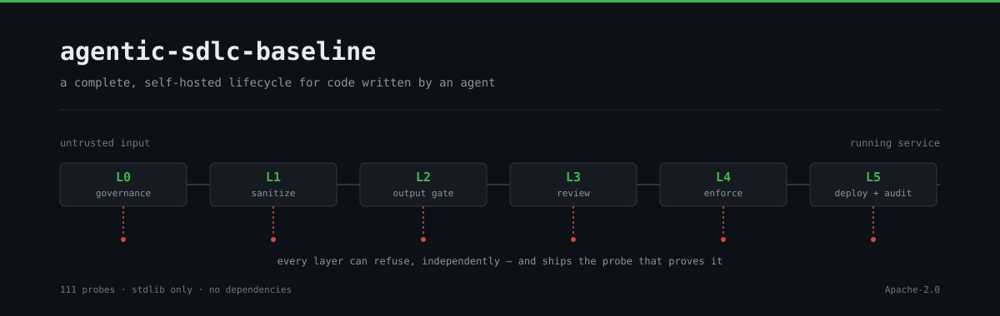
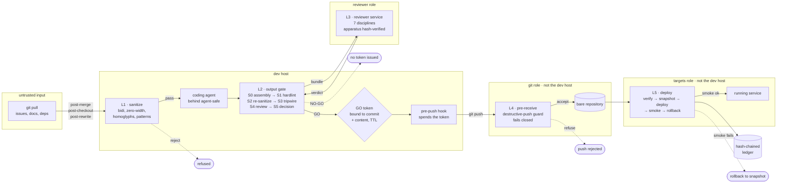
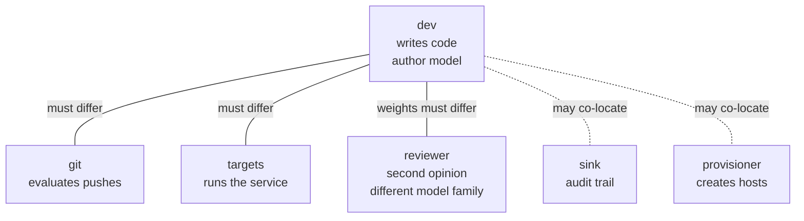
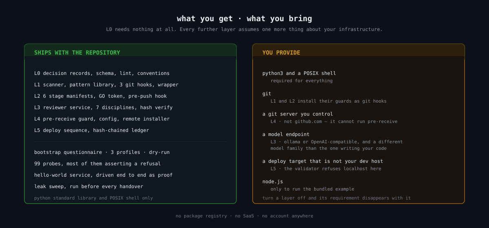

# agentic-sdlc-baseline

A complete lifecycle for code written by an agent: a decision is recorded, code
is written for it, the input scanner sees the working copy, an output gate
assembles and reviews the changeset, a token is bound to the commit, the git
server evaluates the push, the deploy verifies and smoke-tests the result, and
an append-only ledger records what happened.

Every layer is optional except the first. Every layer ships at least one probe
that proves it refuses what it claims to refuse, because a baseline that only
demonstrates the happy path teaches the wrong half.

> **If you are reading this on GitHub, one layer of this baseline is not
> available to you here.** L4 is a `pre-receive` hook, and github.com does not
> run pre-receive hooks — they exist only on GitHub Enterprise Server. On
> github.com the destructive-push guard degrades to branch protection plus a CI
> approximation, which is client-bypassable in ways the hook is not: a force
> push accepted by the API is already applied by the time CI sees it, and
> required checks gate merges rather than pushes. The installer refuses to
> pretend otherwise; see [Known limits](#known-limits). This repository's own
> home is a self-hosted forge for exactly that reason, and the GitHub copy is a
> published mirror.

## How it fits together

Content enters from the left, code leaves to the right, and every box between
them can say no. The layers are the gates; each one refuses independently, and
none of them trusts that the previous one did its job.



**L0 sits underneath all of it** and needs no infrastructure at all: the decision
records, the schema, the index, the append-only amendment protocol, and the
commit convention. It is the only layer that cannot be switched off, because it
is the one that leaves a trace of *why* the rest looks the way it does.

Three of the boundaries above carry the security property. The rest is
preference:



- **git ≠ dev** — a dev host that owns the git server can remove the hook that
  is supposed to constrain it.
- **targets ≠ dev** — otherwise the hand that writes code reaches the running
  service directly.
- **reviewer model ≠ author model** — the same weights reviewing themselves is a
  self-check with correlated blind spots. This one is about the model, not the
  machine: a reviewer on the same host is still a second opinion.

`python3 lib/inventory.py --validate` refuses an inventory that collapses any of
the three, and the bootstrap will not proceed past a refusal. The reasoning —
including which separations turned out *not* to be load-bearing, and why the
reviewer one was originally got wrong — is in
[ADR-0002](docs/adr/ADR-0002-role-model.md).

## What this is not

It is not a framework, and there is nothing to import. It is not a CI template.
It does not assume your topology: the only file allowed to name a machine is
`inventory.yaml`, which the bootstrap writes from a questionnaire and which is
git-ignored, so nothing about your network is in what you clone or what you
share back.

It also does not claim that any of this makes an agent safe to run unattended.
What it does is make a specific set of failures loud: content that arrives
poisoned, output that carries something it should not, a review that never
happened, a push that destroys history, a deploy that broke and stayed broken.

**It assumes your agent runs as a process on a machine you control** — your
workstation, a build host, a VM, a container you start. L1 puts a wrapper in
front of the agent's binary and installs git hooks in a local clone; L2's
enforcement is a client-side `pre-push` hook. Neither exists when the agent runs
in somebody else's infrastructure and hands you a branch.

With a **cloud-hosted agent** you keep L0, L3, L4 and L5 — the reviewer is an
HTTP service, the destructive-push guard judges every push regardless of origin,
the deploy runs where you run it. You lose L1 entirely and L2's *enforcement*,
though the gate itself still runs after the fact. Extending it would mostly take
one change: teaching the pre-receive hook to require a valid GO token, which
would move the gate from advisory to enforced for local and hosted agents alike.
[docs/using-it.md](docs/using-it.md#where-the-agent-runs--and-where-this-stops-working)
lays out the whole boundary, layer by layer.

## What you get, what you bring



| You need | For | Notes |
|---|---|---|
| python3 ≥ 3.8 + bash ≥ 3.2 | everything | no packages, no virtualenv, no registry |
| git | L1, L2 | both install their guards as git hooks |
| a git server you control | L4 | **not github.com** — it cannot run pre-receive hooks |
| a model endpoint | L3 | ollama or OpenAI-compatible, in a different model family than the one writing your code |
| a deploy target ≠ dev host | L5 | the validator refuses a target pointing at localhost |
| node.js | the example only | nothing in the pipeline itself needs it |

Turn a layer off in `inventory.yaml` and its requirement disappears with it. L0
needs nothing at all, which is why it cannot be switched off.

**Portability.** Python 3.8 is the floor — verified by parsing every module
against that grammar, not by assuming it. The shell scripts avoid bash 4
constructs so that macOS's bash 3.2 is enough, and hashing goes through
`sha256sum` or, where that is absent as on macOS, `shasum -a 256`; both produce
byte-identical seals. What has actually been *executed* is Linux with Python
3.11 and bash 5. The macOS path is verified by construction and by a
`shasum`-only run, not by a full suite on a Mac.

**About the model.** L3 is the only layer that needs one, and it is the layer
where the requirement is a property rather than a product: the reviewer must not
share a model family with whatever wrote the code, because the same weights
reviewing themselves produce a self-check with correlated blind spots. A small
local model is enough and is the better choice for a second reason — your source
code never has to leave the building to be reviewed. `provider: offline` exists
so the acceptance run works before you have any model at all; it returns a canned
verdict, and the run says so rather than letting a green token imply a review
happened.

## How do we know it works?

Fair question, and the honest answer has two halves.

**What is demonstrated.** Run `./tools/run-probes.sh` and you get 113 cases across
all six layers plus the bootstrap. Most of them assert a *refusal*, which is the
half that matters: a collapsed separation, a token spent on the wrong commit, an
edited reviewer prompt, a push deleting decision records, a rewritten ledger
entry. They build throwaway repositories in a temp directory and touch nothing of
yours. The example service is driven through the full sequence — verify,
snapshot, deploy, smoke — and then through the failure path, where the smoke test
fails on purpose, the rollback restores the snapshot, and both events land in a
hash chain that `ledger.py verify` rejects if anyone edits it afterwards.

The reviewer's HTTP path is exercised too, against a protocol-accurate endpoint
that can be told to misbehave: both wire protocols, plus a 500, a 401, a
timeout, malformed JSON, prose wrapped around the answer, and a review that
covers four of the seven disciplines. Every one of those produces a refusal, and
an unusable review produces a NO-GO with no token — which matters more than the
happy path, because otherwise the easiest way past the gate would be a model
having a bad day.

**What is not.** The probes were written alongside the code they test, so they
prove internal consistency, not correctness against an adversary who did not
write them. Beyond that, three things remain unproven in the field:

- **Your model, on your changesets.** The pipeline has been driven end to end
  against a real local model — `qwen3:8b` over Ollama — which found a planted
  credential, classified it correctly and placed it on the right line, and the
  gate issued a GO. That run also produced the one substantive bug this
  repository has had so far: the prompt presented file content unnumbered while
  the output contract demanded exact line ranges, so a correct review was
  discarded over an off-by-two. Fixed by numbering the lines. What remains
  unknowable in advance is whether *your* model, on *your* code, produces
  reviews worth reading.

  Measured on that setup, for calibration: five consecutive reviews of a
  three-line changeset carrying a planted credential and a planted shell
  injection came back usable 5/5, at a median of 104 seconds, finding both
  planted problems every time. A larger changeset did produce one run where the
  model broke the output contract and the gate refused — which is the designed
  behaviour, and also the friction to expect: on a small model a NO-GO is
  sometimes the model having a bad run rather than a finding. The audit log
  distinguishes the two, and `reason` tells you which you got.
- **The pre-receive hook against a live forge.** Its 14 probes run against
  throwaway bare repositories. Installing it on a running git server is a step
  nobody has taken here yet.
- **Remote deploy.** `--remote` prints a plan and stops. Shipping a script that
  ssh-es into a host it has never seen, using a service manager it cannot know,
  and calls the result a deploy would be worse than shipping nothing.

None of that is hidden in a changelog. It is here, in the README, because a
baseline whose subject is where guarantees stop should be the last thing to
overstate its own.

## Sixty seconds, no infrastructure

The governance spine needs nothing but a shell:

```sh
./layers/l0-governance/adr-lint.sh
```

That checks every decision record against the schema, the index, and the
append-only amendment protocol. If you only want the workflow, you are done —
clone it and go.

## A suggestion about getting it running

Setting this up is a series of decisions rather than a series of commands: which
layers you want, which model reviews, which separations your topology can
actually keep, what counts as a destructive push in your repository. The
documentation explains each one, and it is a lot of reading for a first
afternoon.

**If you have a coding agent, point it at this repository.** It can read the
layer reference, run the probes, walk through the bootstrap questionnaire with
you and explain each refusal you hit. That is a slightly circular way to install
the machinery that constrains agents — and it is also the fastest way through,
which is why it is worth saying out loud rather than leaving as an in-joke.

The circularity is not accidental. Most of this repository was written by an
agent working under an earlier version of these same layers, which is where a
fair number of its refusals come from: they caught something.

## The full bootstrap

```sh
./bootstrap/init.sh --dry-run     # the complete plan, nothing touched
./bootstrap/init.sh               # questionnaire, then apply
```

The questionnaire asks only about layers you enabled, shows the full role
assignment, and makes you confirm it before anything is created. A dry run
prints the same steps the real run executes — the same code path, printed
instead of run, so the plan cannot drift away from the behaviour.

Profiles: `existing-infra` (default, provisions nothing), `single-host`,
`proxmox-full`. Each one states in the run which guarantee it does **not**
deliver. See [docs/bootstrap.md](docs/bootstrap.md).

## Using it with your own agent

The bootstrap installs the machinery. The loop you work in afterwards is five
things, and only one of them is manual:

```sh
# once: put an agent you already have behind the wrapper — one command
./layers/l1-input-hardening/install-wrapper.sh --agent your-agent
export SDLC_AGENT_BIN=/usr/local/bin/your-agent-real   # the installer prints this

# once: keep the reviewer running, or the gate fails closed on every push
sudo cp layers/l3-reviewer/reviewer.service.example /etc/systemd/system/sdlc-reviewer.service
sudo systemctl enable --now sdlc-reviewer

# then, per change:
your-agent                                    # L1 scans before it starts
git commit -m "script(scope): do the thing"   # L0 checks the message
python3 layers/l2-output-gate/pipeline.py     # S0…S5, issues the GO token
git push                                      # pre-push spends it, L4 judges it
```

The gate is the manual step, deliberately: it talks to a model and takes as long
as your model takes, and a hook that silently blocks a push for ninety seconds
is a hook people uninstall.

Two things you must set for the guarantees to be real rather than nominal:
`roles.dev.author_model` in `inventory.yaml`, because the reviewer/author
separation is checked against what you *declare*; and your own tripwire canaries,
because the shipped one is an example and a canary is worth what its obscurity
is worth.

**One installation serves every project.** The wrapper resolves its scanner next
to itself, so the baseline can live once at `/opt/agentic-sdlc-baseline` and
scan every repository on the machine — nothing is vendored into your projects.
A fleet goes in with one command:

```sh
./layers/l1-input-hardening/install-wrapper.sh --from-file ~/agents.txt
```

Measured, so you can size it: the L1 scan costs 0.28 s cold and 0.09 s warm, the
deterministic gate stages 0.04 s — both disappear into the noise at any fleet
size. The review costs **104 s** and serialises, which makes it the only thing
that needs planning: one reviewer handles about 276 reviews per eight-hour day,
so a hundred agents pushing five times each needs roughly two. The gate runs per
**push**, not per agent, so push frequency is the number that matters.
[docs/using-it.md](docs/using-it.md) has the table and the honest gap — several
model hosts means a load balancer you run, not code you get here.

**[docs/using-it.md](docs/using-it.md)** covers the whole loop, including a table
of every refusal you can hit and what it means — in particular the distinction
between `model-error`, which is the machinery having a bad day, and a finding,
which is the machinery working. Treating those two the same is how a team learns
to bypass on reflex.

## The layers

| | Layer | Needs | Refuses |
|---|---|---|---|
| L0 | Governance spine | nothing | an ADR that drifts from the index, an accepted decision edited in place |
| L1 | Input hardening | git | content that fails the scan, before an agent reads it |
| L2 | Output gate | L1 | a push without a valid GO token for exactly this commit |
| L3 | Independent review | a model | a review by the author's own weights; a tampered apparatus |
| L4 | Server enforcement | a git server you control | a push that deletes history or protected paths |
| L5 | Deploy + audit | a deploy target | a deploy whose smoke test fails — it rolls back |

Details, guarantees and the negative probe for each: [docs/layers.md](docs/layers.md).

## Known limits

- **The gate is enforced client-side.** `pre-push` lives in `.git/hooks`, and
  anything that can write there can remove it. L4 refuses destructive pushes but
  does **not** check for a GO token, so a push that skipped the gate is accepted
  by the server as long as it destroys nothing. L2 makes skipping the gate a
  decision somebody takes on purpose; it does not make it impossible. Teaching
  the pre-receive hook to require the token is the single highest-value
  extension to this repository.
- **The agent is assumed to run locally.** L1 and L2's enforcement do not exist
  for an agent hosted in infrastructure you do not control; L0, L3, L4 and L5
  are unaffected. See
  [docs/using-it.md](docs/using-it.md#where-the-agent-runs--and-where-this-stops-working).
- **github.com does not run pre-receive hooks.** They exist only on GitHub
  Enterprise Server. Against github.com, L4 degrades to branch protection plus a
  CI approximation, which is client-bypassable in ways the hook is not: a force
  push accepted by the API is already applied by the time CI sees it. The
  installer refuses to pretend otherwise. See
  [branch-protection.md](layers/l4-server-enforcement/branch-protection.md).
- **`provider: offline` reviews nothing.** It returns a canned verdict so the
  acceptance run works before you have a model. The gate mechanics are real; the
  review is not.
- **The bootstrap cannot verify separation.** It checks what `inventory.yaml`
  claims. Two different addresses may still be one machine.
- **A canary is worth what its obscurity is worth.** L3's tripwire ships a
  mechanism and an example. Place your own.

## Acceptance run

Proves the machinery on a real service, end to end, with no dependencies beyond
Node.js for the example itself:

```sh
./tools/run-probes.sh                                      # 113 cases, all layers
./layers/l5-deploy-audit/deploy.sh --target hello-world --local
SDLC_BREAK_SMOKE=1 ./layers/l5-deploy-audit/deploy.sh --target hello-world --local
python3 layers/l5-deploy-audit/ledger.py verify
```

`run-probes.sh` runs every layer's suite — 113 cases, and most of them assert a
**refusal**: a collapsed separation, a token spent on the wrong commit, an
edited reviewer prompt, a push that deletes decision records, a rewritten
ledger entry. Run one suite alone with `./tools/run-probes.sh l2`.

| Suite | Cases | Asserts |
|---|---|---|
| L0 | 9 | index drift, id mismatch, the amendment coupling |
| L1 | 15 | bidi, zero-width, homoglyphs, an audited bypass, fail-closed patterns, one baseline scanning another project |
| L2 | 14 | no token, stale token, edited seal, expired TTL, edited manifest, a reviewer that is unreachable *and* one that answers with garbage |
| L3 | 10 | edited apparatus, missing seal, the reviewer/author family check |
| L3 backends | 10 | the real HTTP path: both protocols, plus 500, 401, timeout, malformed JSON, half a review |
| L4 | 20 | mass delete, protected paths and refs, a broken hook failing closed, and never clobbering a forge's own hook |
| L5 | 11 | edited, removed and re-hashed ledger entries; target declarations; refusing to take a port it does not own |
| bootstrap | 24 | every collapsed separation, refusal to guess, dry-run purity, idempotence |

The third line of the acceptance run is the one that matters: the smoke test
fails on purpose, the deploy rolls back to the pre-deploy snapshot, and the
ledger records both the failure and the rollback in a hash chain that `verify`
will not accept if anyone edits it afterwards.

## Before you share this

```sh
python3 tools/leak-sweep.py
```

Refuses to leave the repository carrying an address, an internal hostname, a
container id, a key or a token. Findings are either real, in which case they
belong in `inventory.yaml`, or declared with a written reason. There is no
option that lets one pass silently, because "review carefully before sharing" is
exactly the control that degrades under time pressure.

## License

Apache License 2.0 — see [LICENSE](LICENSE) and [NOTICE](NOTICE).

Apache rather than MIT for one reason that matters here: §3 grants patent rights
explicitly. This is infrastructure that organisations wire into their own
release path, and a permissive licence without a patent grant is the kind of
detail that stalls exactly that adoption. The warranty disclaimer is worth
reading rather than skimming, for a repository whose subject is the points at
which security properties stop holding.

No licence headers in source files. The licence covers the work; a header in
every file lengthens every diff and changes nothing legally.

## Versions

`v0.3.0` — see [CHANGELOG.md](CHANGELOG.md).

Deliberately `0.x`. Two things have to be true before this claims a 1.0, and
neither is yet: the pre-receive guard has never run on a live git server, and
the output gate is enforced by a client-side hook that anything with write
access to `.git/hooks` can remove.

## Repository layout

```
bootstrap/       questionnaire, profiles, the one hypervisor-coupled directory
layers/l0..l5/   one directory per layer, each independently removable
lib/             inventory accessor and a small YAML reader (stdlib only)
docs/            layer reference, the daily loop, bootstrap guide, ADRs
example/         the hello-world service the acceptance run drives
tools/           the pre-handover leak sweep
```

Everything is Python standard library or POSIX shell. There is no dependency to
install, because a security baseline that needs a package registry before it can
check anything has a bootstrap problem of its own.
